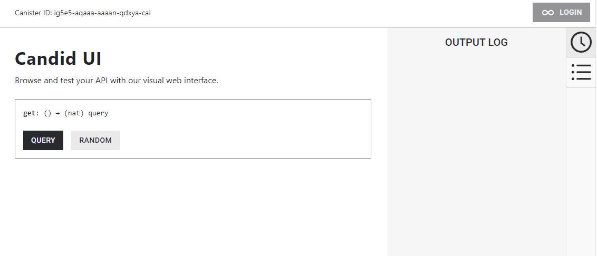

import TeamContact from '../../../contact.md';

# dfx deps


## 概览 {#overview}

当开发者在互联网计算机 (IC) 上进行开发，有时候需要在本地开发环境集成、并测试第三方[容器](https://ic123.xyz/docs/getting-started/ic-glossary/#canister)。这样可以在本地验证第三方容器的功能，而无需在主网部署、支付 cycles 费用。

[dfx deps](https://ic123.xyz/docs/getting-started/use-dfx/#dfx-deps) 正是这样的一组子命令，旨在为在本地开发环境中集成和测试第三方容器提供一致的工作流程。其中第三方容器：
- 可以是由 DFINITY 基金会所创建（例如 Internet Identity 或 NNS canister）；
- 也可以是由 ICP 社区成员所创建的提供公共服务的容器。

`dfx deps` 命令包含以下子命令：

- `dfx deps pull`：从 IC 主网拉取依赖容器并生成 `deps/pulled.json` 文件；
- `dfx deps init`：为拉取的依赖容器设置初始化参数、并保存在 `deps/init.json` 中；
- `dfx deps deploy`：使用 `deps/init.json` 中的初始化参数在本地开发环境部署依赖容器。

关于 `dfx deps` 及其子命令的具体使用，请参考[相关文档](https://ic123.xyz/docs/getting-started/use-dfx/#dfx-deps)。

接下来本教程将演示如何使用 `dfx deps` 的相关功能。

## 要求 {#prerequisites}

- 下载并安装 [IC SDK](https://ic123.xyz/docs/getting-started/install-dfx/)。  
- 下载[示例仓库](https://github.com/lwshang/pullable)。 

## 工作流程

在使用 `dfx deps` 的工作流程中有两个角色：**服务提供者**和**服务消费者**。

### 服务提供者

**服务提供者**需要配置一个容器、使其可被拉取。一个可拉取的容器需满足以下条件：

- 该容器在一个静态容器 ID 下提供公共服务（即容器 ID 保持不变）；
- 该容器的 Wasm 模块必须通过 URL 托管，以便**服务消费者**在通过执行 `dfx deps pull` 拉取依赖容器时进行下载。

如何决定一个容器是否需要被配置为可拉取？

- 如果您的容器提供公共服务、且容器 ID 不变，则可以配置为可拉取；
- 如果您的容器只是提供个人服务，则无需配置为可拉取；
- 如果您计划将容器代码共享给开发者创建自己的容器实例，则无需配置为可拉取；
- 另外如果您的容器依赖到其他的容器，那这些所依赖的容器也都需要配置为可拉取。

如果您决定配置一个容器为可拉取，请编辑该容器所在项目的 `dfx.json` 文件并包含类似以下信息：

```json
{
  "canisters": {
    "service": {
      "type": "motoko",
      "main": "src/pullable/main.mo",
      "pullable": {
        "dependencies": [],
        "wasm_url": "https://github.com/lwshang/pullable/releases/latest/download/service.wasm",
        "init_guide": "A natural number, e.g. 1"
      }
    }
  }
}
```

其中：

- `wasm_url`：提供容器的 Wasm 模块下载的 URL；
- `init_guide`：提供消息引导如何初始化容器。

这里我们只使用了两个参数，如需了解其他参数请查看[完整参数列表](https://github.com/dfinity/sdk/blob/master/docs/concepts/pull-dependencies.md#service-provider-workflow)。

### 服务消费者

当容器配置为可拉取之后，**服务消费者**可以直接从 IC 主网拉取该容器作为依赖，然后将该依赖容器部署到本地开发环境。

要从 IC 主网拉取依赖容器，**服务消费者**所在工程的 `dfx.json` 文件必须包括容器的依赖配置。以下 `dfx.json` 文件为 容器 app 配置了一个可拉取的依赖容器。

```json
{
    "canisters": {
        "app": {
            "type": "motoko",
            "main": "src/main.mo",
            "dependencies": [
                "service"
            ]
        },
        "service": {
            "type": "pull",
            "id": "ig5e5-aqaaa-aaaan-qdxya-cai"
        }
    }
}
```

容器 `service` 在 IC 主网的 ID 为 `ig5e5-aqaaa-aaaan-qdxya-cai`。当您执行 `dfx deps pull` 命令时，该依赖容器就会被拉取到本地。

## 部署服务提供者 {#deploy-provider}

[示例仓库](https://github.com/lwshang/pullable)已经帮助我们在 IC 主网部署了一个可拉取容器作为服务提供者。这是该示例的 [dfx.json](https://github.com/lwshang/pullable/blob/main/dfx.json) 文件，其中 `wasm_url` 指向了 GitHub 的发布地址。您可以通过 Candid UI 查看[该容器](https://a4gq6-oaaaa-aaaab-qaa4q-cai.raw.ic0.app/?id=ig5e5-aqaaa-aaaan-qdxya-cai)。

您可以通过该示例学习如何将容器配置为可拉取，这里我们就不再演示如何向 IC 主网进行部署。

:::note
如果您的工程是开源的，使用 `GitHub Releases` 来作为 Wasm 模块的下载地址是一个不错的选择。您可以参考示例仓库中的 [Release](https://github.com/lwshang/pullable/blob/main/.github/workflows/release.yml) GitHub Action 来进行项目发布。
:::

## 部署服务消费者 {#deploy-consumer}

当您完成[示例仓库](https://github.com/lwshang/pullable)下载之后，请进入 `example` 目录、并启动本待开发环境。

```bash
cd example
dfx start --clean --background
```

### dfx deps pull

请在 `example` 目录下执行 `dfx deps pull` 命令：

```bash
dfx deps pull
```

如果成功，您将会看到类似如下的输出信息：

```bash
Fetching dependencies of canister ig5e5-aqaaa-aaaan-qdxya-cai...
Found 1 dependencies:
ig5e5-aqaaa-aaaan-qdxya-cai
Pulling canister ig5e5-aqaaa-aaaan-qdxya-cai...
```

此时在 `~/.cache/dfinity` 目录下，你会看到新创建的 `pulled/ig5e5-aqaaa-aaaan-qdxya-cai/` 目录，其中包含了所依赖容器的 `Wasm` 代码以及 `Candid` 文件。

同时在 当前的 `example` 目录下，您会看到新创建的 `deps` 目录，其中包含了 `candid` 目录以及 `pulled.json` 文件。

```json
{
  "canisters": {
    "ig5e5-aqaaa-aaaan-qdxya-cai": {
      "name": "service",
      "wasm_hash": "dd5813001da596db6a136ac02348cd84e28b4f90f4fc108aeb54af4c2290db4b",
      "wasm_hash_download": "dd5813001da596db6a136ac02348cd84e28b4f90f4fc108aeb54af4c2290db4b",
      "init_guide": "A natural number, e.g. 1",
      "init_arg": null,
      "candid_args": "(nat)",
      "gzip": false
    }
  }
}
```

这里的 `init_arg` 为空，是因为在配置**服务提供者**容器时并未提供 `init_arg` 的参数配置。请参考**服务提供者**容器的 [dfx.json](https://github.com/lwshang/pullable/blob/main/dfx.json) 文件。

### dfx deps init

接下来执行 `dfx deps init` 命令来创建容器初始化文件。

```bash
dfx deps init
```

此时在 `deps` 目录下会创建 `init.json` 文件，内容如下：

```json
{
  "canisters": {}
}
```

同时在命令行，您将会看到以下输出：

```bash
WARN: The following canister(s) require an init argument. Please run `dfx deps init <NAME/PRINCIPAL>` to set them individually:
ig5e5-aqaaa-aaaan-qdxya-cai (service)
```

这是因为所依赖的容器需要初始化参数，而`pulled.json` 中 `init_arg` 为 null。因此我们需要执行如下命令来设置初始化参数：

```bash
dfx deps init service --argument 1
```

此时 `deps/init.json` 文件会更新为：

```json
{
  "canisters": {
    "ig5e5-aqaaa-aaaan-qdxya-cai": {
      "arg_str": "1",
      "arg_raw": "4449444c00017d01"
    }
  }
}
```

:::note
需要注意的是，即使您所依赖的容器没有初始化参数，您也需要执行 `dfx deps init`。这是因为后续的 `dfx deps deploy` 命令会检查该文件，无论初始化参数是否为空。
:::

### dfx deps deploy

接下来执行 `dfx deps deploy` 命令将所依赖容器部署到本地开发环境。

```bash
dfx deps deploy
```

该命令将会：
- 在本地开发环境部署所依赖容器，该容器的 ID 与 IC 主网相同；
- 安装所下载的 Wasm 代码，并用 `init.json` 中所提供的参数进行初始化。

在命令行，您将会看到以下输出：

```bash
Creating canister: ig5e5-aqaaa-aaaan-qdxya-cai (service)
Installing canister: ig5e5-aqaaa-aaaan-qdxya-cai (service)
```

## 测试 {#test}

您可以在本地部署 `example` 工程中的容器用来测试所依赖的容器。

```bash
dfx deploy
```

在命令行，您将会看到类似如下的输出：
```bash
...
Building canisters...
Installing canisters...
Creating UI canister on the local network.
The UI canister on the "local" network is "bd3sg-teaaa-aaaaa-qaaba-cai"
Installing code for canister app, with canister ID bkyz2-fmaaa-aaaaa-qaaaq-cai
Deployed canisters.
URLs:
  Backend canister via Candid interface:
    app: http://127.0.0.1:4943/?canisterId=bd3sg-teaaa-aaaaa-qaaba-cai&id=bkyz2-fmaaa-aaaaa-qaaaq-cai
    service: http://127.0.0.1:4943/?canisterId=bd3sg-teaaa-aaaaa-qaaba-cai&id=ig5e5-aqaaa-aaaan-qdxya-cai
...
```

- 请在浏览器中打开 `service` 的 URL，您将会看到如下界面：

  

  点击 `Query` 按钮，将返回 `1`。

- 请在浏览器中打开 `app` 的 URL，您将会看到如下界面：

  

  点击 `Call` 按钮，将返回 `2`。

<TeamContact />
